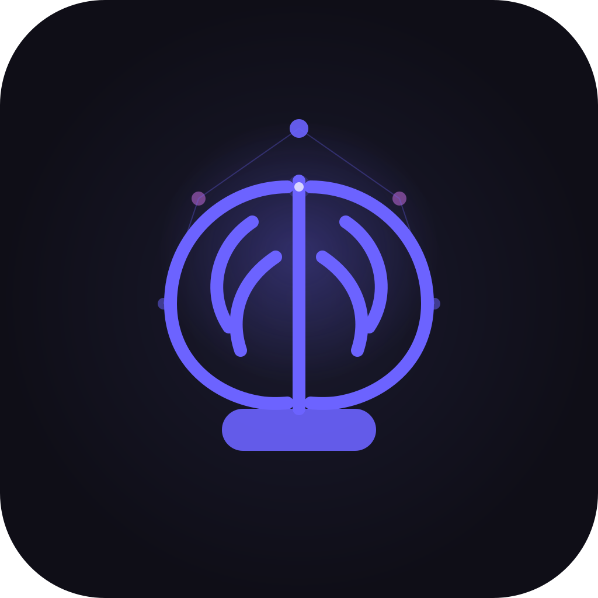

<p align="center">
  
</p>

<h1 align="center">Focobit</h1>
<p align="center">
  <strong>App multiplataforma para personas con TDAH</strong><br />
  <em>Multi-platform app for people with ADHD</em>
</p>

<p align="center">
  <a href="#español">Español</a> •
  <a href="#english">English</a>
</p>

---

# Español

## Descripción

**Focobit** es una aplicación de productividad y bienestar diseñada específicamente para personas con TDAH. Combina gestión de tareas, sesiones de enfoque (Pomodoro), rutinas, gamificación y soporte para días difíciles (modo crisis).

### Características principales

| Módulo | Descripción |
|--------|-------------|
| **Tareas** | Gestión de tareas con micro-pasos generados por IA (Gemini), prioridad y energía requerida |
| **Focus** | Sesiones de enfoque configurables (5–25 min) con recompensas XP y monedas |
| **Rutinas** | Rutinas mañana/noche/personalizadas con rachas y recordatorios |
| **Progreso** | Árbol de habilidades, logros, retos semanales y estadísticas |
| **Tienda** | Power-ups, temas visuales, avatares y badges desbloqueables con monedas |
| **Temas** | 6 temas visuales (default, ocean, forest, sunset, midnight, aurora) |
| **Siri Shortcuts** | Acciones rápidas: nueva tarea, iniciar focus, check-in, modo crisis |
| **Alexa Skill** | Comandos de voz: "¿Cuántas tareas tengo?", "Agregar tarea X", "¿Cuál es mi racha?" |

### Stack tecnológico

- **Mobile:** Expo (React Native) + TypeScript + Zustand
- **Web:** Next.js 14 + TypeScript
- **Backend:** Firebase (Firestore, Auth, Functions, Analytics, Crashlytics)
- **IA:** Google Gemini para micro-pasos
- **Monorepo:** pnpm workspaces

---

## Estructura del proyecto

```
Focobit/
├── apps/
│   ├── mobile/          # App iOS/Android (Expo)
│   ├── web/             # Web app (Next.js)
│   ├── functions/       # Firebase Cloud Functions
│   ├── alexa-skill/     # Alexa Skill (AWS Lambda)
│   ├── watch-ios/       # Apple Watch (Swift)
│   └── watch-android/   # Wear OS
├── packages/
│   ├── shared/          # Tipos, constantes, utilidades compartidas
│   └── firebase-config/ # Configuración Firebase, servicios
├── app.config.ts        # Configuración Expo
├── eas.json             # Configuración EAS Build
└── pnpm-workspace.yaml
```

---

## Requisitos previos

- **Node.js** 20+ (recomendado)
- **pnpm** 9+
- **Cuenta Firebase** con proyecto Blaze
- **Cuenta Expo** (para EAS Build)
- **Cuenta Apple Developer** (para TestFlight/App Store)

---

## Instalación

```bash
# Clonar el repositorio
git clone https://github.com/Victordaz07/Focobit.git
cd Focobit

# Instalar dependencias
pnpm install

# Configurar variables de entorno (ver .env.example en cada app)
# apps/mobile: .env.local
# apps/web: .env.local
# apps/functions: .env
```

---

## Comandos principales

| Comando | Descripción |
|---------|-------------|
| `pnpm mobile` | Iniciar app móvil (Expo) |
| `pnpm web` | Iniciar app web (Next.js) |
| `pnpm functions` | Desarrollo Firebase Functions |
| `pnpm build:web` | Build producción web |
| `pnpm build:functions` | Build y deploy Functions |
| `pnpm type-check` | Verificación TypeScript en todo el monorepo |

---

## Configuración Firebase

1. Crear proyecto en [Firebase Console](https://console.firebase.google.com)
2. Habilitar: Authentication, Firestore, Functions, Analytics
3. Registrar apps: iOS (com.focobit.app), Android (com.focobit.app), Web
4. Descargar `GoogleService-Info.plist` y `google-services.json` → `apps/mobile/`
5. Configurar Firebase Functions con variables: `GEMINI_API_KEY`, etc.

---

## EAS Build y TestFlight

```bash
cd apps/mobile

# Login EAS
eas login

# Build desarrollo (simulador)
eas build --platform ios --profile development

# Build producción
eas build --platform ios --profile production

# Build + submit a TestFlight
eas build --platform ios --profile production --auto-submit
```

Ver guía detallada en `apps/mobile/TESTFLIGHT_STEPS.md`.

---

## Alexa Skill

La skill vive en `apps/alexa-skill/`. Ver `apps/alexa-skill/SETUP.md` para:

1. Crear skill en Alexa Developer Console
2. Configurar modelo de interacción
3. Desplegar Lambda en AWS
4. Vincular cuenta en la app (Ajustes → Amazon Alexa)

---

## Temas visuales

Los temas se definen en `packages/shared/src/data/themes.ts` y se sincronizan desde Firestore (`equippedTheme`). El usuario puede equipar temas desde la Tienda.

---

## Licencia

Proyecto privado. Todos los derechos reservados.

---

# English

## Description

**Focobit** is a productivity and wellness app designed specifically for people with ADHD. It combines task management, focus sessions (Pomodoro), routines, gamification, and support for difficult days (crisis mode).

### Main features

| Module | Description |
|--------|-------------|
| **Tasks** | Task management with AI-generated micro-steps (Gemini), priority and energy required |
| **Focus** | Configurable focus sessions (5–25 min) with XP and coin rewards |
| **Routines** | Morning/night/custom routines with streaks and reminders |
| **Progress** | Skill tree, achievements, weekly challenges and statistics |
| **Store** | Power-ups, visual themes, avatars and badges unlockable with coins |
| **Themes** | 6 visual themes (default, ocean, forest, sunset, midnight, aurora) |
| **Siri Shortcuts** | Quick actions: new task, start focus, check-in, crisis mode |
| **Alexa Skill** | Voice commands: "How many tasks do I have?", "Add task X", "What's my streak?" |

### Tech stack

- **Mobile:** Expo (React Native) + TypeScript + Zustand
- **Web:** Next.js 14 + TypeScript
- **Backend:** Firebase (Firestore, Auth, Functions, Analytics, Crashlytics)
- **AI:** Google Gemini for micro-steps
- **Monorepo:** pnpm workspaces

---

## Project structure

```
Focobit/
├── apps/
│   ├── mobile/          # iOS/Android app (Expo)
│   ├── web/             # Web app (Next.js)
│   ├── functions/       # Firebase Cloud Functions
│   ├── alexa-skill/     # Alexa Skill (AWS Lambda)
│   ├── watch-ios/       # Apple Watch (Swift)
│   └── watch-android/   # Wear OS
├── packages/
│   ├── shared/          # Shared types, constants, utilities
│   └── firebase-config/ # Firebase configuration, services
├── app.config.ts        # Expo configuration
├── eas.json             # EAS Build configuration
└── pnpm-workspace.yaml
```

---

## Prerequisites

- **Node.js** 20+ (recommended)
- **pnpm** 9+
- **Firebase account** with Blaze project
- **Expo account** (for EAS Build)
- **Apple Developer account** (for TestFlight/App Store)

---

## Installation

```bash
# Clone the repository
git clone https://github.com/Victordaz07/Focobit.git
cd Focobit

# Install dependencies
pnpm install

# Configure environment variables (see .env.example in each app)
# apps/mobile: .env.local
# apps/web: .env.local
# apps/functions: .env
```

---

## Main commands

| Command | Description |
|---------|-------------|
| `pnpm mobile` | Start mobile app (Expo) |
| `pnpm web` | Start web app (Next.js) |
| `pnpm functions` | Firebase Functions development |
| `pnpm build:web` | Production web build |
| `pnpm build:functions` | Build and deploy Functions |
| `pnpm type-check` | TypeScript verification across monorepo |

---

## Firebase setup

1. Create project in [Firebase Console](https://console.firebase.google.com)
2. Enable: Authentication, Firestore, Functions, Analytics
3. Register apps: iOS (com.focobit.app), Android (com.focobit.app), Web
4. Download `GoogleService-Info.plist` and `google-services.json` → `apps/mobile/`
5. Configure Firebase Functions with variables: `GEMINI_API_KEY`, etc.

---

## EAS Build and TestFlight

```bash
cd apps/mobile

# EAS login
eas login

# Development build (simulator)
eas build --platform ios --profile development

# Production build
eas build --platform ios --profile production

# Build + submit to TestFlight
eas build --platform ios --profile production --auto-submit
```

See detailed guide in `apps/mobile/TESTFLIGHT_STEPS.md`.

---

## Alexa Skill

The skill lives in `apps/alexa-skill/`. See `apps/alexa-skill/SETUP.md` for:

1. Create skill in Alexa Developer Console
2. Configure interaction model
3. Deploy Lambda on AWS
4. Link account in app (Settings → Amazon Alexa)

---

## Visual themes

Themes are defined in `packages/shared/src/data/themes.ts` and sync from Firestore (`equippedTheme`). Users can equip themes from the Store.

---

## License

Private project. All rights reserved.
